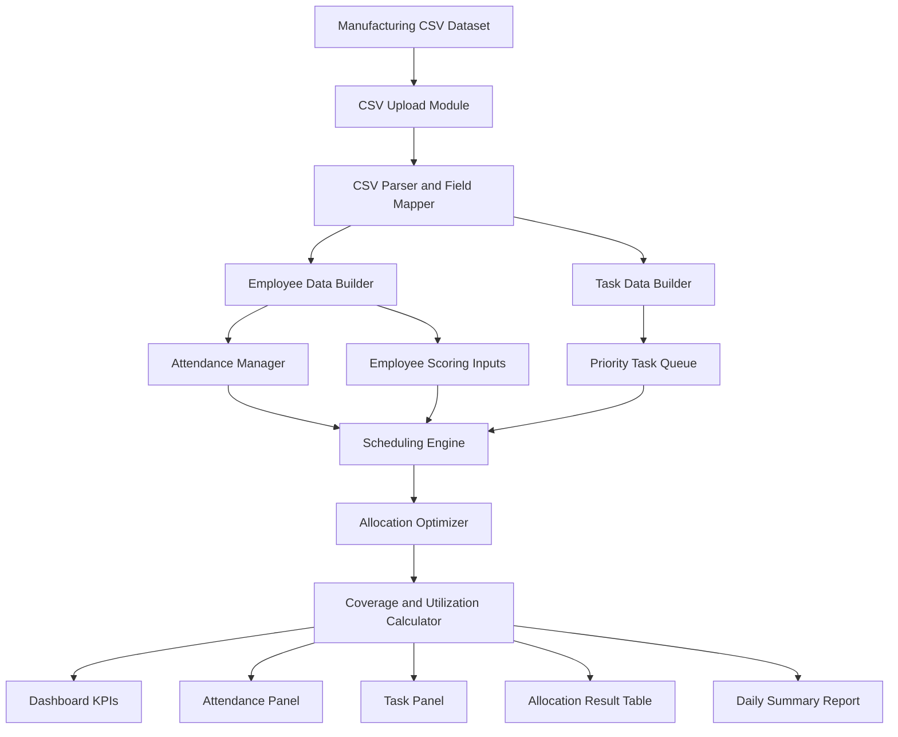
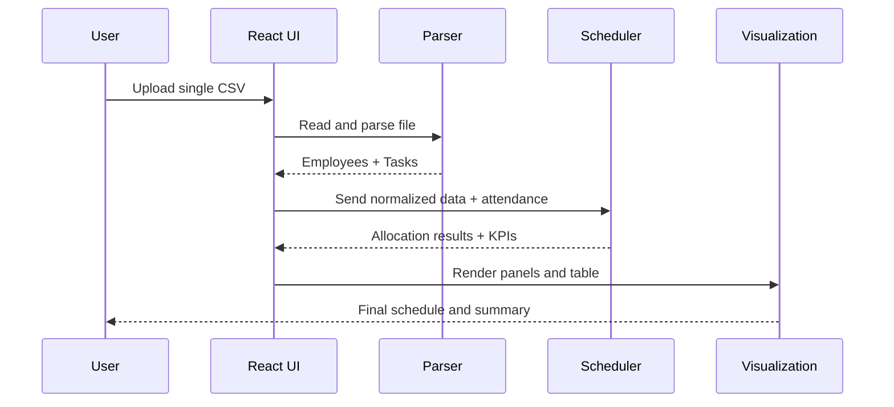

# Smart Workforce Scheduling and Allocation System

This project is a React + TypeScript web application for scheduling factory workforce based on:

- employee attendance
- skill levels
- performance and workload
- task priority and staffing demand

It accepts one manufacturing CSV dataset and generates workforce allocation recommendations.

## Block Diagram Structure



## Layer-Wise Architecture

1. Input Layer
- One CSV file upload from user.
- Handles manufacturing worker and task-related columns.

2. Processing Layer
- CSV parsing and normalization.
- Mapping aliases such as worker_id, task_type, shift, productivity, and required_people.

3. Data Modeling Layer
- Builds employee objects.
- Builds task objects.
- Creates attendance map for active scheduling.

4. Decision Layer
- Score calculation based on skills, experience, performance, workload, and mistakes.
- Priority-first scheduling of tasks.
- Team assignment with shortage and skill coverage checks.

5. Output Layer
- Live workforce dashboard.
- Allocation table with assigned team per task.
- Capacity and utilization metrics.

## Data Flow Summary



## Core Functional Modules

- CSV Upload Module: Handles file selection and read.
- Parsing Module: Converts raw CSV into structured rows.
- Normalization Module: Maps flexible column names.
- Employee Module: Builds worker profile and skill matrix.
- Task Module: Builds task demand and priority model.
- Scheduling Engine: Assigns best-fit members to tasks.
- Reporting Module: Displays KPIs, coverage, and manpower summary.

## Run the Project

```bash
npm install
npm run dev
```

Open `http://localhost:5173` in browser.
